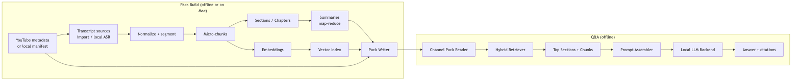
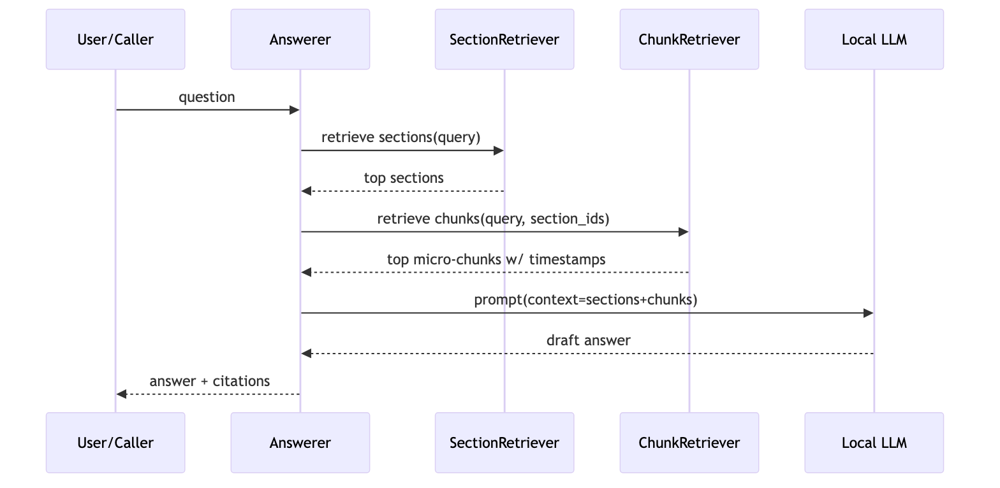

# Architecture

This project is organized around two workflows:

1. **Pack Build**: ingest → process → index → pack.
2. **Q&A**: retrieve → assemble context → generate answer → cite.

## High-level component diagram

## Sequence: answering a question (long videos)

## Key runtime boundaries

- **Ingestion and pack build** can be heavier (macOS recommended).
- **Pack read + retrieval + LLM** can run on-device.
- The **Channel Pack format** is intentionally portable so iOS can implement the same logic.

Next: `docs/03_data_model.md`.
