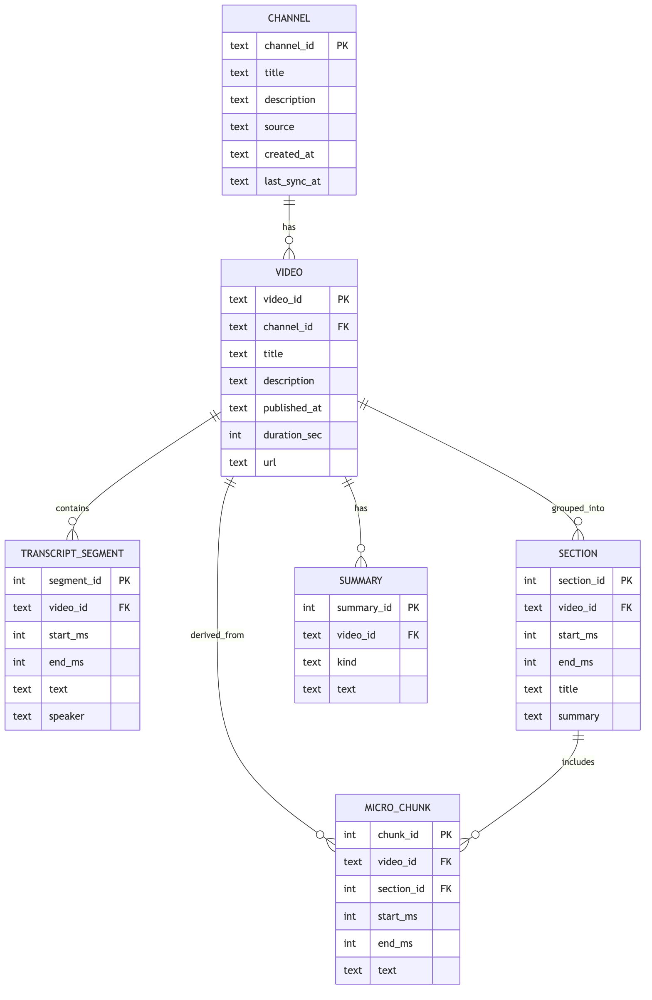

# Data model and storage

We use SQLite in the pack for portability and transactional writes.

## Entity overview (ER-ish)

## SQLite schema (pack)

See `src/yt_channel_expert/pack/schema.py` for the canonical schema.

Important:
- micro-chunks store `start_ms/end_ms` for timestamp citations.
- sections group micro-chunks for long video structure.

Next: `docs/04_ingestion.md`.
