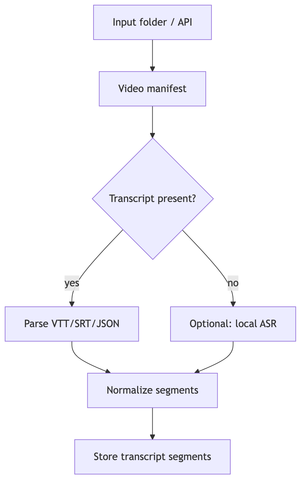

# Ingestion

This repo is intentionally **source-agnostic** about transcripts:

- Use **manual transcript import** (VTT/SRT/JSON) and/or **local transcription** from audio you are authorized to use.
- If you **own/manage** the channel, you can implement an OAuth caption downloader.

The pack builder expects a local folder with:
- `channel.json` (channel_id, title, description, source)
- `videos.json` (array of video items: video_id, title, url, published_at, duration_sec)
- `transcripts/VIDEO_ID.(vtt|srt|json)` files (optional per video)

See `examples/demo_channel/`.

## Playlist or series-only packs

You can build a pack for a subset of a channel (playlist/series/date range) by generating smaller `channel.json` and `videos.json` files that only include those videos, plus the matching transcript files.

Example (playlist-only):

`channel.json`:

```json
{
  "channel_id": "UC123",
  "title": "Example Channel",
  "source": "playlist:PLabc123"
}
```

`videos.json`:

```json
[
  {
    "video_id": "vid_001",
    "title": "Episode 1",
    "url": "https://youtube.com/watch?v=vid_001",
    "published_at": "2023-06-01T00:00:00Z",
    "duration_sec": 1800
  },
  {
    "video_id": "vid_002",
    "title": "Episode 2",
    "url": "https://youtube.com/watch?v=vid_002",
    "published_at": "2023-06-08T00:00:00Z",
    "duration_sec": 1920
  }
]
```

Then place transcripts in `transcripts/vid_001.vtt`, `transcripts/vid_002.vtt`, etc., and run the pack build on that folder.

## YouTube selection helpers (new package)

This repo includes `yt_channel_expert.ingestion.youtube` to help consuming apps select videos and write the expected `channel.json` and `videos.json` files.

Key ideas:
- Default selection is the latest 20 videos.
- You can override with a playlist or a manual video list from a UI.
- The helper writes the manifest files; you still provide transcripts.
- Implement the `YouTubeCatalog` protocol (get_channel, list_videos, list_playlist_video_ids) in your app.

Example usage:

```python
from pathlib import Path
from yt_channel_expert.ingestion.youtube import SelectionSpec, build_manifest_from_catalog

catalog = MyYouTubeCatalog(api_key="...")  # your app implements this

# Default: latest 20
build_manifest_from_catalog(catalog, channel_ref="https://youtube.com/@creator", output_dir=Path("input"))

# Playlist override
selection = SelectionSpec(mode="playlist", playlist_id="PLabc123")
build_manifest_from_catalog(catalog, channel_ref="https://youtube.com/@creator", output_dir=Path("input"), selection=selection)

# Manual override (UI-selected)
selection = SelectionSpec(mode="manual", video_ids=["vid_001", "vid_002"])
build_manifest_from_catalog(catalog, channel_ref="https://youtube.com/@creator", output_dir=Path("input"), selection=selection)
```

## Hybrid transcript acquisition (captions first, ASR fallback)

For apps that want automatic transcript acquisition, this repo includes a helper that tries:

1. `youtube-transcript-api` (fast if captions exist)
2. `yt-dlp` subtitles (auto captions where available)
3. ASR fallback (Whisper or faster-whisper)

This is convenient but relies on scraping and availability of captions, so it can break if YouTube changes formats. Use only where you have rights to access the content.

Example usage:

```python
from pathlib import Path
from yt_channel_expert.ingestion.youtube import (
    TranscriptFetchConfig,
    WhisperTranscriber,
    fetch_and_write_transcript,
)

config = TranscriptFetchConfig(languages=["en"], allow_auto=True, allow_ytdlp=True)
transcriber = WhisperTranscriber(model_name="base")

fetch_and_write_transcript(
    output_dir=Path("input"),
    video_id="vid_001",
    url="https://youtube.com/watch?v=vid_001",
    config=config,
    transcriber=transcriber,
)
```

Install optional deps:

```bash
pip install .[youtube,whisper]
```

If you manage the channel, you can also implement an OAuth caption downloader in your app and write `transcripts/*.json` directly.

## Ingestion flow



## Chapters

Chapters can come from:
- explicit timestamps in the video description (if present),
- or **auto-chaptering** based on topic shifts (see `docs/05_chunking_and_sections.md`).

Next: `docs/05_chunking_and_sections.md`.
