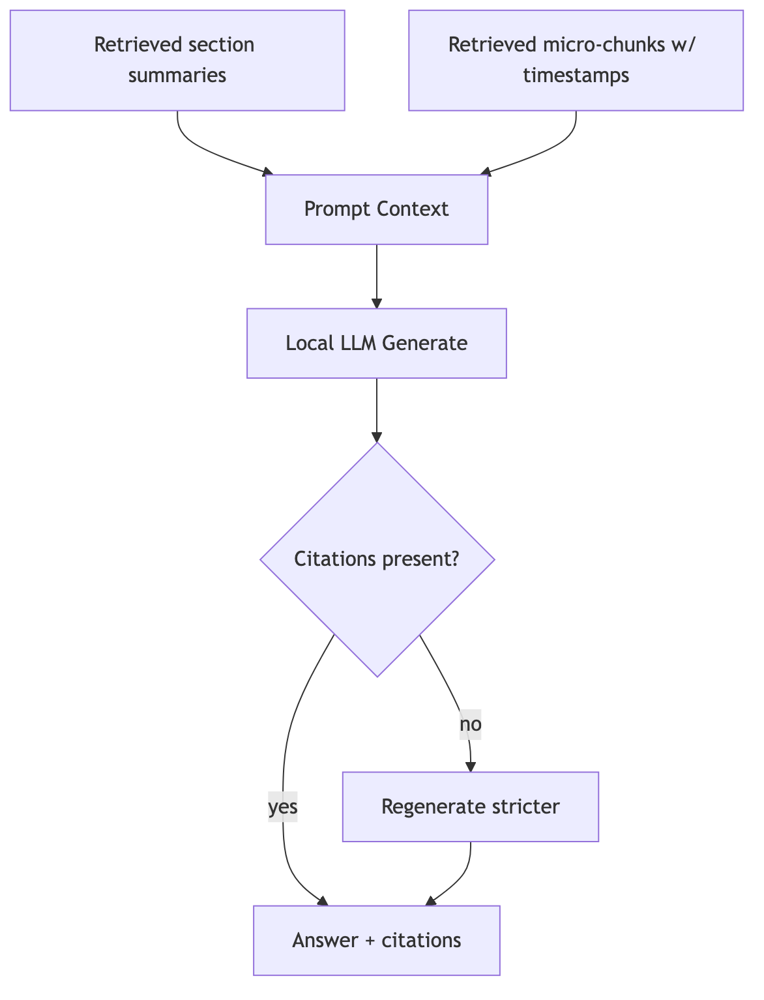

# RAG answering and citations

## Goals

- Every factual claim should be grounded in the pack.
- Provide citations:
  - video title
  - video id / URL
  - timestamp span
  - quote snippet (optional)

## Retrieval steps (recommended defaults)

1. Retrieve top `K=5` sections from section-summary index.
2. Retrieve top `N=10` micro-chunks restricted to those sections.
3. Assemble prompt context:
   - brief channel profile
   - section summaries
   - micro-chunk excerpts (verbatim)
4. Generate answer with local LLM.
5. Validate:
   - if answer lacks citations for non-trivial claims → regenerate with stricter prompt.

## Prompt contract

The prompt should:
- forbid claims not supported by evidence snippets,
- require citations appended to each paragraph or bullet.

## Mermaid: prompt assembly

Implementation reference:
- `src/yt_channel_expert/rag/answerer.py`
- `src/yt_channel_expert/rag/prompts.py`
- `src/yt_channel_expert/rag/citations.py`
